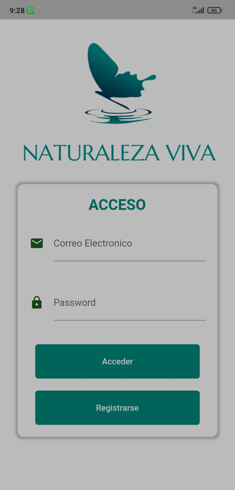
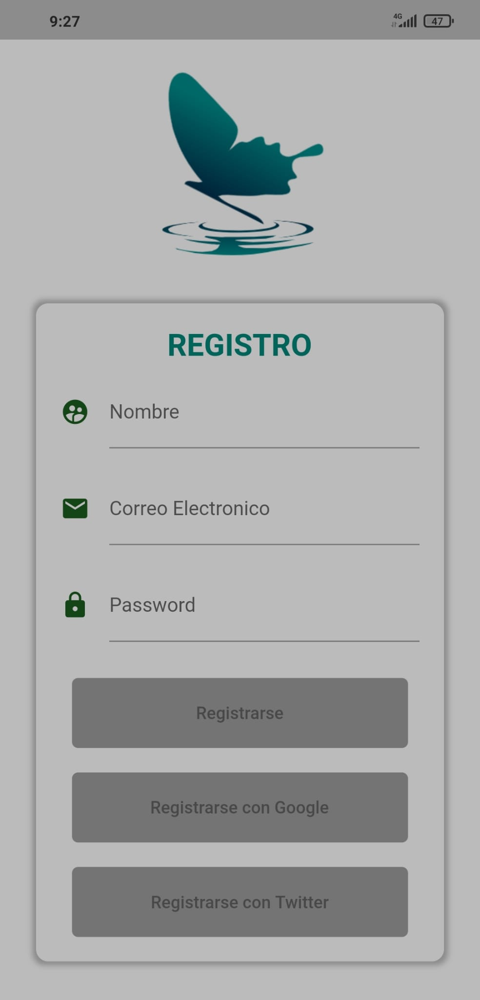
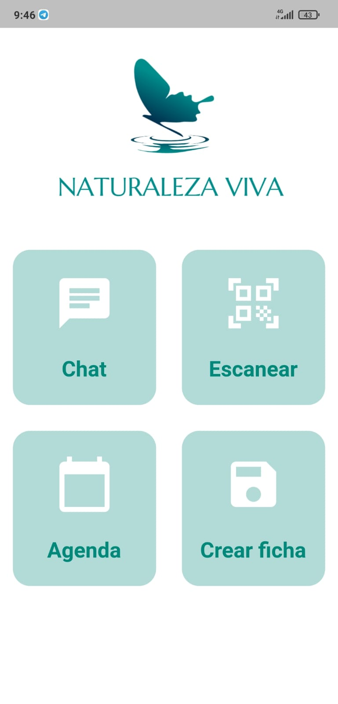
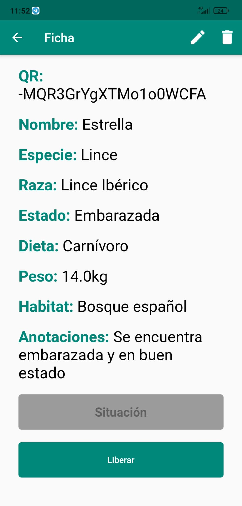
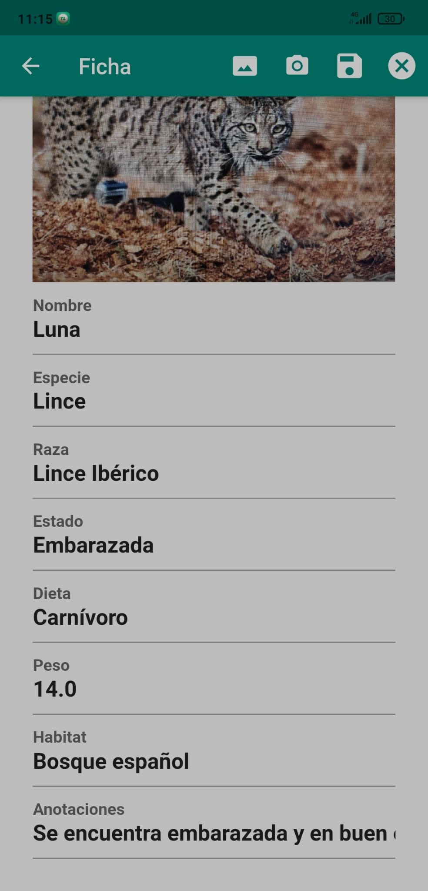
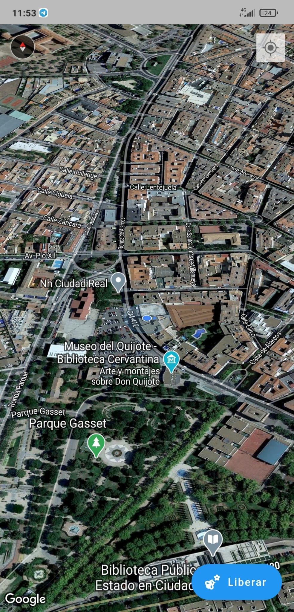
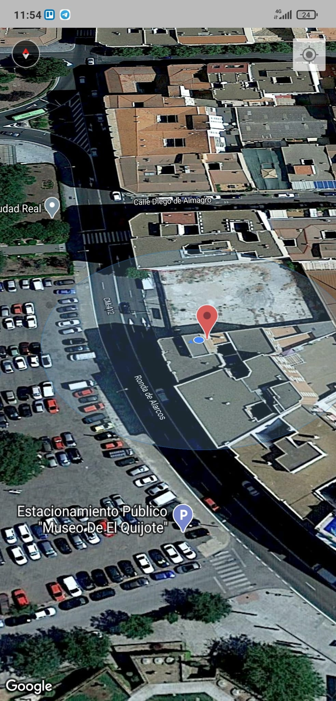

<html lang="en">
  <head>
    <!-- Required meta tags -->
    <meta charset="utf-8">
    <meta name="viewport" content="width=device-width, initial-scale=1">

    <!-- Bootstrap CSS -->
    <link href="https://cdn.jsdelivr.net/npm/bootstrap@5.0.0-beta1/dist/css/bootstrap.min.css" rel="stylesheet" integrity="sha384-giJF6kkoqNQ00vy+HMDP7azOuL0xtbfIcaT9wjKHr8RbDVddVHyTfAAsrekwKmP1" crossorigin="anonymous">

    <title>Hello, world!</title>
  </head>
  <body>
    <h1>MANUAL DE USUARIO</h1>
    <!--style="max-width: 540px;"-->
    

      

        

          
        

        

          

            <h5 class="card-title">Login de Acceso</h5>
            
En esta pantalla incluiremos nuestras credenciales para asi poder dar paso dentro de la aplicacion y poder ver la ficha de los animales, su situacion y poder liberarlos

          

        

      

    

    

      

        

          
        

        

          

            <h5 class="card-title">Pantalla de registro</h5>
            
En esta pantalla podremos darnos de alta en el sistema de Naturaleza Viva. Debemos introducir correctamente un correo electronico, nuestro nombre y una contraseña que cuente con al menos 6 caracteres

          

        

      

    

    

      

        

          
        

        

          

            <h5 class="card-title">Pantalla Principal</h5>
            
En esta pantalla contamos con todas las opciones que nos ofrede el sistema movil de Naturaleza Viva. Podremos chatear con el sistema central de la protectora, escanear los codigos QR de los animales para ver sus fichas, mirar la agenda semanal y dar de alta a nuevos animales en el sistema

          

        

      

    

    

      

        

          
        

        

          

            <h5 class="card-title">Ficha de los animales</h5>
            
En esta pantalla podremos visualizar las fichas de los animales, con todos us datos, previa lectura del codigo QR propio y unico de cada animal

          

        

      

    

    

      

        

          
        

        

          

            <h5 class="card-title">Edicion de las fichas</h5>
            
En esta pantalla podremos editar o eliminar los animales selecionados. Podemos tanto cambiar su foto como los distintos atributos que se reflejan

          

        

      

    

    

      

        

          
        

        

          

            <h5 class="card-title">Liberacion</h5>
            
En esta pantalla podremos liberar al animal selecionado, pulsando el boton de liberar, guardaremos con ello los datos de la localizacion del mismo en nuestra base de datos

          

        

      

    

    

      

        

          
        

        

          

            <h5 class="card-title">Seguimiento del animal</h5>
            
En esta pantalla podremos realizar un seguimiento del animal en tiempo real

          

        

      

    

    <!-- Optional JavaScript; choose one of the two! -->

    <!-- Option 1: Bootstrap Bundle with Popper -->
    

    <!-- Option 2: Separate Popper and Bootstrap JS -->
    <!--
    
    
    -->
    
    
  </body>
</html>
